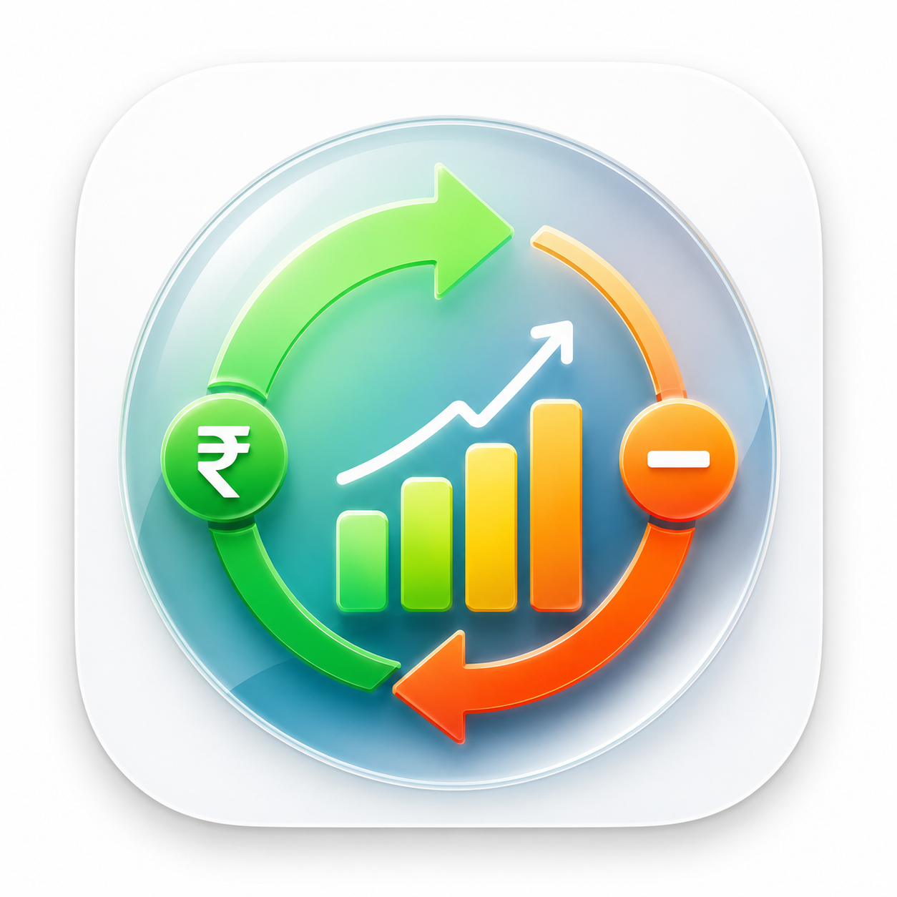
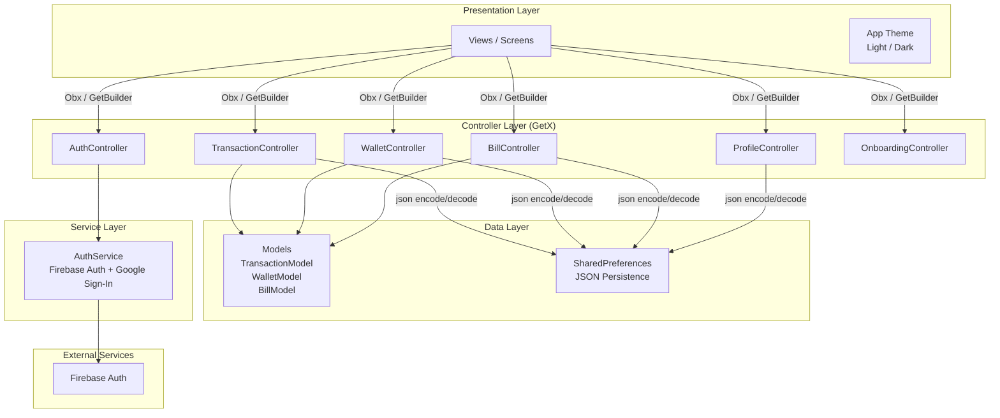
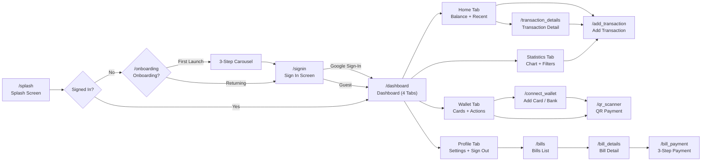
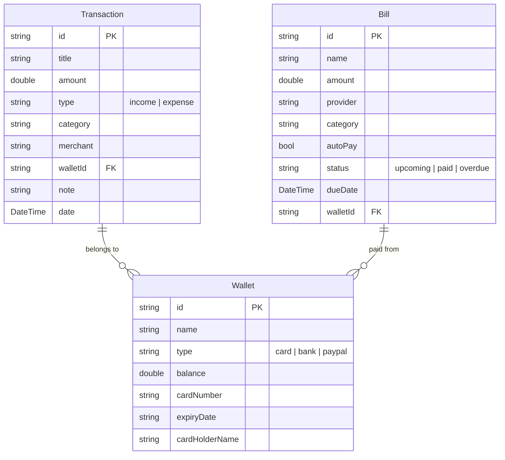

<div align="center">
  

  # Income & Expense Tracker

  **A cross-platform Flutter application for personal finance management**

  [](https://flutter.dev)
  [](https://dart.dev)
  [](LICENSE)

  <p>
    Track income & expenses · Manage wallets & cards · Visualize spending statistics · Pay bills
  </p>
</div>

---

## Table of Contents

- [Features](#features)
- [Screenshots](#screenshots)
- [Tech Stack](#tech-stack)
- [Architecture](#architecture)
- [Getting Started](#getting-started)
  - [Prerequisites](#prerequisites)
  - [Installation](#installation)
  - [Firebase Setup](#firebase-setup)
  - [Running the App](#running-the-app)
  - [Building for Release](#building-for-release)
- [Project Structure](#project-structure)
- [Available Scripts](#available-scripts)
- [Contributing](#contributing)
- [License](#license)

---

## Features

### Authentication & Onboarding
- Splash screen with fade-in animation and automatic auth state resolution
- 3-step onboarding flow introducing core app capabilities
- Google Sign-In via Firebase Authentication
- Guest mode for users who prefer to explore without signing in

### Dashboard
- **Home** — Total balance card with income/expense breakdown, recent transaction feed, and quick-send contact avatars
- **Statistics** — Period filters (Day / Week / Month / Year) with interactive line charts powered by `fl_chart`, income/expense type segmentation, and top spending breakdown
- **Wallets** — Multi-wallet management, balance overview, segmented transaction/upcoming bills view, QR-code-based payments via `mobile_scanner`
- **Profile** — User profile management, dark theme toggle, biometric lock, data export, and sign-out

### Transaction Management
- Add transactions with merchant selection (Netflix, YouTube, PayPal, Upwork, etc.), categorized tags, date picker, wallet source, optional notes and invoice attachments
- Receipt-style transaction details with copyable transaction ID, status badges, and delete with automatic balance reversal
- Income/expense type toggle on every transaction

### Wallets & Cards
- Add debit cards with form fields for card number, expiry, CVC, and ZIP code
- Connect bank accounts via bank link, microdeposits, or PayPal
- QR scanner for wallet-to-wallet payments

### Bills & Payments
- Upcoming/due bills with overdue, due-today, and due-in-X-days status indicators
- Bill details with invoice-style layout and auto-pay toggle
- 3-step payment wizard: review → confirm → success with receipt

### Personalization
- Light & dark themes with teal-based color palette
- Profile customization (avatar, name, notification preferences)
- Biometric authentication toggle for app security

---

## Screenshots

| Homepage | Statistics | Wallets |
|:--------:|:----------:|:-------:|
| /Homepage3.png) | /Statistic4.png) | /Wallet7.png) |

> **Note:** Full design mockups and a PDF spec are available in the `Income & Expense Tracker App (Community)/` directory.

---

## Tech Stack

| Layer           | Technology                                                                 |
|----------------|----------------------------------------------------------------------------|
| **Language**   | Dart 3.12+                                                                 |
| **Framework**  | Flutter (stable channel)                                                   |
| **State Mgmt** | [GetX](https://pub.dev/packages/get) — reactive state, DI, routing         |
| **Auth**       | Firebase Authentication + Google Sign-In                                   |
| **Storage**    | SharedPreferences (local JSON persistence)                                 |
| **Charts**     | [fl_chart](https://pub.dev/packages/fl_chart)                              |
| **QR Scanner** | [mobile_scanner](https://pub.dev/packages/mobile_scanner)                  |
| **Icons**      | flutter_launcher_icons                                                     |
| **Fonts**      | Google Fonts (Outfit)                                                      |
| **Linting**    | flutter_lints                                                              |

---

## Architecture

### Layer Diagram



### App Navigation Map



### Data Model Relationships



**Key Architectural Decisions:**

- **GetX State Management** — Controllers are global singletons registered via `Get.put()` in `main.dart`, accessed via `Get.find()` throughout the app. Screens observe reactive state with `Obx`.
- **Local-First Storage** — All CRUD operations use `SharedPreferences` with JSON serialization. There is no remote database — data never leaves the device.
- **Firebase Auth Only** — Firebase is used solely for Google Sign-In authentication. No Firestore, Realtime Database, or cloud functions.
- **Mock Data Seeding** — On first launch, the app seeds sample transactions, wallets, and bills so the UI is never empty.

---

## Getting Started

### Prerequisites

- [Flutter SDK](https://docs.flutter.dev/get-started/install) (stable channel, `>=3.12.0`)
- [Android Studio](https://developer.android.com/studio) or [VS Code](https://code.visualstudio.com/) with Flutter extensions
- A [Firebase project](https://console.firebase.google.com/) with **Authentication** and **Google Sign-In** enabled
- Android device / emulator (API 21+)

### Installation

```bash
# Clone the repository
git clone https://github.com/<your-username>/incomexpense.git
cd incomexpense

# Install dependencies
flutter pub get
```

### Firebase Setup

1. Create a Firebase project at [console.firebase.google.com](https://console.firebase.google.com)
2. Enable **Google Sign-In** in Authentication → Sign-in method
3. Register your Android app in Project settings → General → Your apps
4. Download `google-services.json` and place it in:

   ```
   android/app/google-services.json
   ```

5. (Optional) For iOS, download `GoogleService-Info.plist` and add it to the Xcode project

> **Security:** `google-services.json` and `GoogleService-Info.plist` are gitignored. Never commit them.

### Running the App

```bash
# Run on a connected device or emulator
flutter run

# Run with a specific device
flutter devices          # List available devices
flutter run -d <device-id>
```

### Building for Release

```bash
# Debug APK
flutter build apk --debug

# Release APK
flutter build apk --release

# App Bundle (Play Store)
flutter build appbundle
```

> For a signed release build, configure `android/key.properties` and a keystore file (see [Flutter signing docs](https://docs.flutter.dev/deployment/android#signing-the-app)).

---

## Project Structure

```mermaid
block-beta
  columns 3

  block:EntryPoint["Entry Point"]:1
    columns 1
    main["main.dart<br/>Get.put() DI<br/>GetPage routes"]
  end

  block:Theme["Theme"]:1
    columns 1
    theme["app_theme.dart<br/>Light + Dark"]
  end

  block:Services["Services"]:1
    columns 1
    svc["auth_service.dart<br/>Firebase + Google Auth"]
  end

  space:3

  block:Controllers["Controllers (GetX)"]:1
    columns 1
    ac["auth_controller.dart"]
    bc["bill_controller.dart"]
    oc["onboarding_controller.dart"]
    pc["profile_controller.dart"]
    tc["transaction_controller.dart"]
    wc["wallet_controller.dart"]
  end

  block:Models["Models"]:1
    columns 1
    bm["bill_model.dart"]
    tm["transaction_model.dart"]
    wm["wallet_model.dart"]
  end

  block:Views["Views / Screens"]:1
    columns 1
    splash["splash_screen.dart"]
    dash["dashboard_screen.dart"]
    onboard["onboarding/"]
    auth["auth/"]
    home["home/"]
    stats["statistics/"]
    wallet["wallet/"]
    profile["profile/"]
    bills["bills/"]
    addtxn["add_transaction/"]
  end
end

```

---

## Available Scripts

| Command                            | Description                        |
|------------------------------------|------------------------------------|
| `flutter pub get`                  | Install dependencies               |
| `flutter run`                      | Run in debug mode                  |
| `flutter build apk`               | Build Android APK                  |
| `flutter build appbundle`         | Build Android App Bundle           |
| `flutter test`                     | Run tests                          |
| `flutter analyze`                  | Run static analysis                |
| `flutter pub run flutter_launcher_icons` | Regenerate app launcher icons |

---

## Contributing

Contributions are welcome! Please follow these steps:

1. Fork the repository
2. Create a feature branch: `git checkout -b feat/my-feature`
3. Commit your changes: `git commit -m "feat: add my feature"`
4. Push to the branch: `git push origin feat/my-feature`
5. Open a pull request

Please ensure your code passes `flutter analyze` and existing tests before submitting.

---

## License

Distributed under the MIT License. See [LICENSE](LICENSE) for more information.

---

<div align="center">
  <sub>Built with ❤️ by <a href="https://github.com/mdmafjujulkarim">MD MAFJUJUL KARIM SHEIKH</a></sub>
</div>
